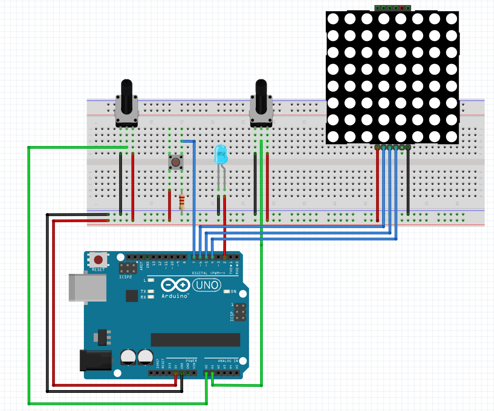

# AnalogAnalyzer
Project for university by `Magical`

This entire project is in italian, because that's my professors' main language (and also mine).
I'll translate the project description for all of you non-italian speakers:

## Project description
Realize an `8-bit` analogic signal sampler, which gets the input at the maximum speed allowed by the processor.
The sampled data must be shown in an 8x8 LED matrix via an `SPI MAX7219` interface.
The system must let the user decide the time base and then visualize, for each led column, the progressive average of the sampled data.

For instance: if the ADC time is `40 uS`, setting a time base of `60 uS/div`, each shown value will be the progressive average of three samples `((a0 + a1) / 2 + a2) / 2`

## Electrical scheme (Fritzing)

